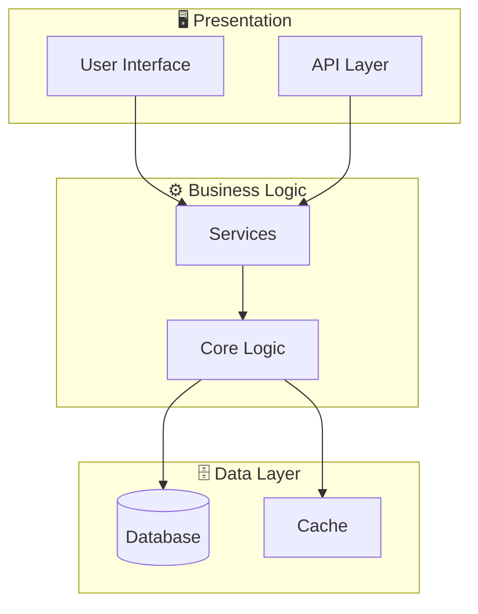
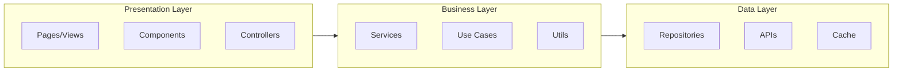

# System Architecture - 665df7cc-8ee3-4b96-a73e-d209aa2defc2

## Architecture Overview

**Pattern:** Monolithic with potential for UI-heavy structure



## Application Layers



## Technology Stack

| Layer | Technology | Purpose |
|-------|------------|---------|
| Language | TypeScript | Main language |
| Framework | Vite | Main framework |

## Directory Structure

```
src/
├── main.ts/
├── ui/
├── graphics/
├── utils/
├── inventory/
└── ... (+3 more)
vite.config.ts/
```

---

*Generated by Code Analysis Agent on February 05, 2026*
