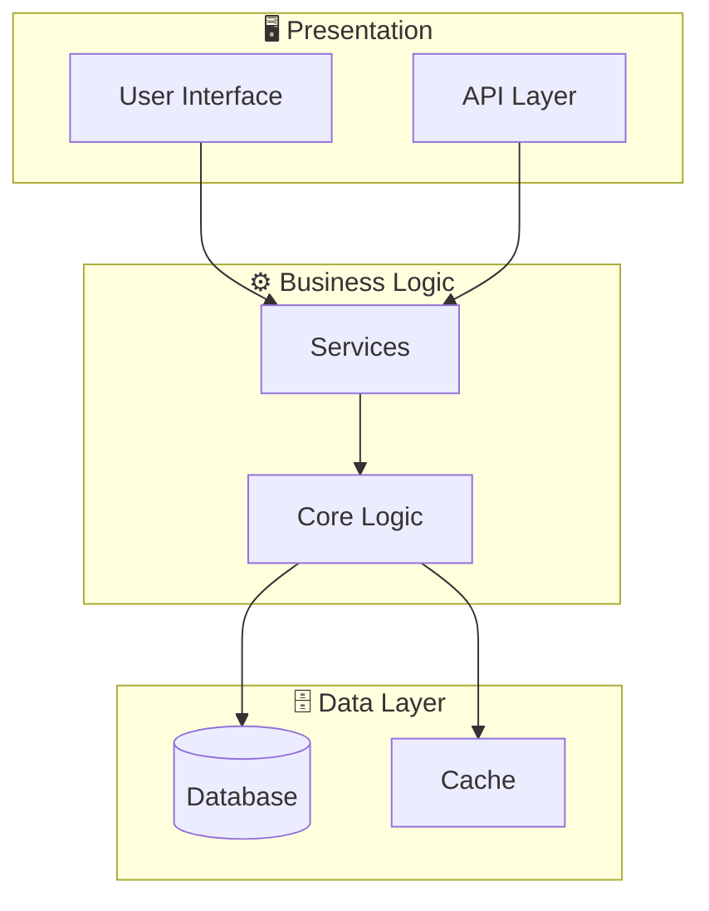
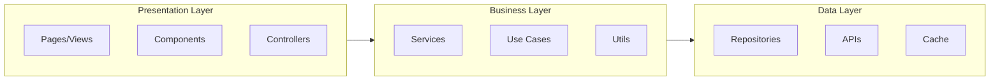

# System Architecture - 812e8e54-66cb-4cee-b2c1-f6bd41d09a7e

## Architecture Overview

**Pattern:** Monolithic with potential for UI layering



## Application Layers



## Technology Stack

| Layer | Technology | Purpose |
|-------|------------|---------|
| Language | TypeScript | Main language |
| Framework | Vite | Main framework |

## Directory Structure

```
src/
├── main.ts/
├── ui/
├── graphics/
├── utils/
├── inventory/
└── ... (+3 more)
vite.config.ts/
```

---

*Generated by Code Analysis Agent on February 04, 2026*
