# System Architecture - 812e8e54-66cb-4cee-b2c1-f6bd41d09a7e

## Architecture Overview

**Pattern:** Monolithic with potential for UI layering

```mermaid
flowchart TB
    subgraph Presentation["🖥️ Presentation"]
        UI[User Interface]
        API[API Layer]
    end
    
    subgraph Business["⚙️ Business Logic"]
        Services[Services]
        Logic[Core Logic]
    end
    
    subgraph Data["🗄️ Data Layer"]
        DB[(Database)]
        Cache[Cache]
    end
    
    UI --> Services
    API --> Services
    Services --> Logic
    Logic --> DB
    Logic --> Cache
```



## Application Layers


## Technology Stack

| Layer | Technology | Purpose |
|-------|------------|---------|
| Language | TypeScript | Main language |
| Framework | Vite | Main framework |

## Directory Structure

```
src/
├── main.ts/
├── ui/
├── graphics/
├── utils/
├── inventory/
└── ... (+3 more)
vite.config.ts/
```

---

*Generated by Code Analysis Agent on February 04, 2026*
