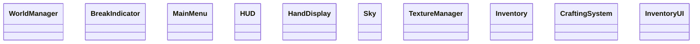

# Class Diagram - 665df7cc-8ee3-4b96-a73e-d209aa2defc2

## Domain Model

## Entity Descriptions

### WorldManager

Location: `src/ui/WorldManager.ts`

### BreakIndicator

Location: `src/ui/BreakIndicator.ts`

### MainMenu

Location: `src/ui/MainMenu.ts`

### HUD

Location: `src/ui/HUD.ts`

### HandDisplay

Location: `src/ui/HandDisplay.ts`

### Sky

Location: `src/graphics/Sky.ts`

### TextureManager

Location: `src/graphics/TextureManager.ts`

### Inventory

Location: `src/inventory/Inventory.ts`

### CraftingSystem

Location: `src/inventory/CraftingSystem.ts`

### InventoryUI

Location: `src/inventory/InventoryUI.ts`

---

*Generated by Code Analysis Agent on February 05, 2026*
