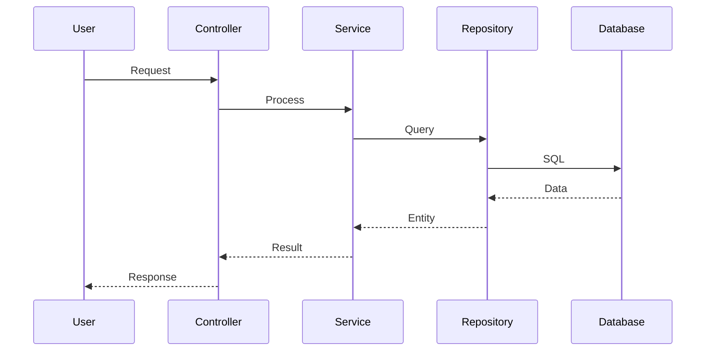

# Flows and Sequences - 665df7cc-8ee3-4b96-a73e-d209aa2defc2

## Main Flows

The main system flows include:

1. **Input Flow** - Receiving and validating data
2. **Processing Flow** - Applying business rules
3. **Output Flow** - Responding to client

Check sequence diagrams below for details.

## Sequence Diagrams

---

*Generated by Code Analysis Agent on February 05, 2026*
