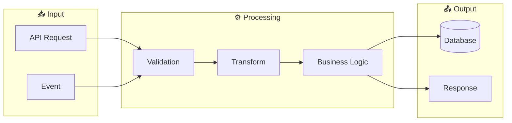

# Data Flow - 665df7cc-8ee3-4b96-a73e-d209aa2defc2

## Flow Diagram

## Flow Description

Data flows through the following layers:

1. **Input**: APIs, events, commands
2. **Validation**: Data verification
3. **Processing**: Business logic
4. **Persistence**: Database, cache
5. **Output**: Responses, events

---

*Generated by Code Analysis Agent on February 05, 2026*
