# Data Flow - 812e8e54-66cb-4cee-b2c1-f6bd41d09a7e

## Flow Diagram

```mermaid
flowchart LR
    subgraph Input["📥 Input"]
        API[API Request]
        Event[Event]
    end
    
    subgraph Process["⚙️ Processing"]
        Validate[Validation]
        Transform[Transform]
        Logic[Business Logic]
    end
    
    subgraph Output["📤 Output"]
        DB[(Database)]
        Response[Response]
    end
    
    API --> Validate
    Event --> Validate
    Validate --> Transform
    Transform --> Logic
    Logic --> DB
    Logic --> Response
```

## Flow Description

Data flows through the following layers:

1. **Input**: APIs, events, commands
2. **Validation**: Data verification
3. **Processing**: Business logic
4. **Persistence**: Database, cache
5. **Output**: Responses, events

---

*Generated by Code Analysis Agent on February 04, 2026*
