# Dependency Graph - 812e8e54-66cb-4cee-b2c1-f6bd41d09a7e

## Statistics

| Metric | Value |
|--------|-------|
| Total Files | 31 |
| Total Functions | 63 |
| Total Classes | 28 |

## Overview

```mermaid
flowchart TB
    main_ts[main.ts]
    main_ts:main[main.ts:main]
    main_ts --> main_ts:main
    WorldManager_ts[WorldManager.ts]
    WorldManager_ts:Worl[WorldManager.ts]
    WorldManager_ts --> WorldManager_ts:Worl
    BreakIndicator_ts[BreakIndicator.]
    BreakIndicator_ts:Br[BreakIndicator.]
    BreakIndicator_ts --> BreakIndicator_ts:Br
    MainMenu_ts[MainMenu.ts]
    MainMenu_ts:MainMenu[MainMenu.ts:Mai]
    MainMenu_ts --> MainMenu_ts:MainMenu
    HUD_ts[HUD.ts]
    HUD_ts:HUD[HUD.ts:HUD]
    HUD_ts --> HUD_ts:HUD
    HandDisplay_ts[HandDisplay.ts]
    HandDisplay_ts:HandD[HandDisplay.ts:]
    HandDisplay_ts --> HandDisplay_ts:HandD
    Sky_ts[Sky.ts]
    Sky_ts:angle[Sky.ts:angle]
    Sky_ts --> Sky_ts:angle
    Sky_ts:t[Sky.ts:t]
    Sky_ts --> Sky_ts:t
    Sky_ts --> Sky_ts:t
    Sky_ts:Sky[Sky.ts:Sky]
    Sky_ts --> Sky_ts:Sky
    TextureManager_ts[TextureManager.]
    TextureManager_ts:ge[TextureManager.]
    TextureManager_ts --> TextureManager_ts:ge
    TextureManager_ts:i[TextureManager.]
    TextureManager_ts --> TextureManager_ts:i
    TextureManager_ts:no[TextureManager.]
    TextureManager_ts --> TextureManager_ts:no
    TextureManager_ts:hu[TextureManager.]
    TextureManager_ts --> TextureManager_ts:hu
    TextureManager_ts:cr[TextureManager.]
    TextureManager_ts --> TextureManager_ts:cr
    TextureManager_ts --> TextureManager_ts:cr
    TextureManager_ts --> TextureManager_ts:cr
    TextureManager_ts --> TextureManager_ts:cr
    TextureManager_ts --> TextureManager_ts:cr
    TextureManager_ts --> TextureManager_ts:cr
```

## Most Connected Modules

- **src/graphics/TextureManager.ts**: 27 connections
- **src/utils/math.ts**: 17 connections
- **src/world/BlockTypes.ts**: 13 connections
- **src/engine/Engine.ts**: 12 connections
- **src/inventory/ItemTypes.ts**: 9 connections
- **src/world/TerrainGenerator.ts**: 9 connections
- **src/world/World.ts**: 9 connections
- **src/utils/noise.ts**: 8 connections
- **src/world/Chunk.ts**: 8 connections
- **src/inventory/Inventory.ts**: 7 connections

---

*Generated by Code Analysis Agent on February 04, 2026*
